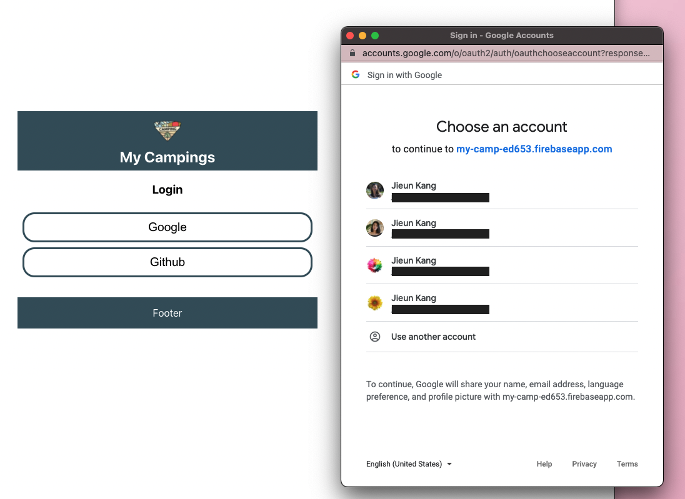
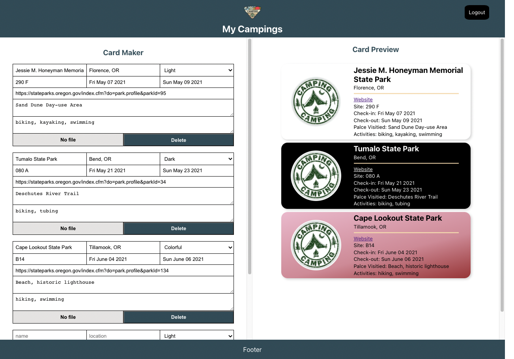
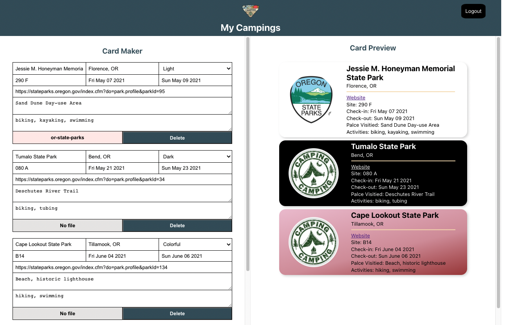

# My Camping Journal React App

#### By **_Jieun Kang_**

## Description

A React application that have CRUD functionality of user's camping journal cards with firebase.

- [Redux Toolkit](https://redux-toolkit.js.org/) for state management
- [Firebase](https://firebase.google.com/docs?authuser=0) for authentication /realtime database
- [PostCSS](https://postcss.org/) for transforming CSS
- [ESLint](https://eslint.org/) for linting and [Prettier](https://prettier.io/) to maintain code conventions and formatting

### ▫︎ Preview

### ▫︎ Implemented the following features:

- A user should be able to sign in with Google or Github and sign out.
- A user should be able to create, update and delete a card. All cards should be stored in the realtime database.
- A user should have their own previews which lists the cards they've added.

## Getting Started

1. Clone the repo
1. `yarn install --frozen-lockfile`
1. `yarn start` will start My Camp website
